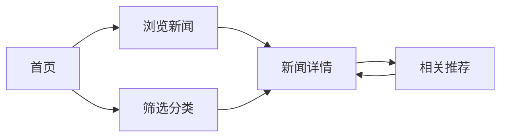
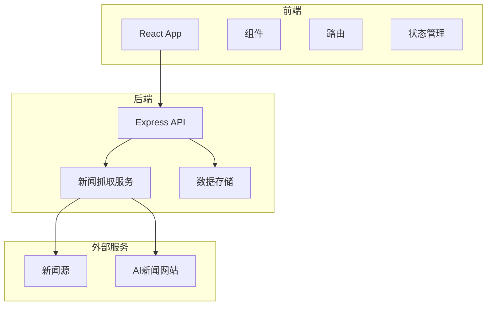
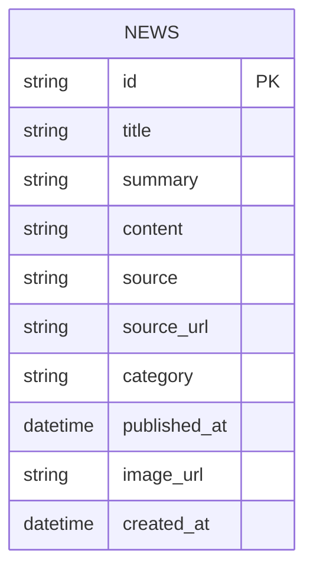

# 每日AI新闻软件 - 项目规划

## 1. 产品需求文档 (PRD)

### 1.1 产品概述
- 每日AI新闻软件是一个聚合全球AI领域最新资讯的Web应用，为用户提供便捷的AI新闻浏览体验
- 目标用户为AI爱好者、从业者、研究人员，帮助他们快速获取AI领域最新动态

### 1.2 核心功能

#### 1.2.1 用户角色
| 角色 | 注册方式 | 核心权限 |
|------|---------|---------|
| 普通用户 | 无需注册 | 浏览新闻、搜索、筛选、阅读详情 |

#### 1.2.2 功能模块
1. **首页**：导航栏、英雄区域、最新AI新闻列表、分类筛选
2. **新闻详情页**：新闻内容展示、相关推荐、来源链接
3. **搜索页**：关键词搜索、结果展示

#### 1.2.3 页面详情
| 页面名称 | 模块名称 | 功能描述 |
|---------|---------|---------|
| 首页 | 导航栏 | Logo、导航链接、搜索框 |
| 首页 | 英雄区域 | 展示今日热门AI新闻、标语 |
| 首页 | 新闻列表 | 卡片式布局、显示标题、摘要、发布时间、来源 |
| 首页 | 分类筛选 | 按AI子领域筛选（LLM、CV、机器人等） |
| 详情页 | 内容展示 | 完整新闻内容、图片、来源信息 |
| 详情页 | 相关推荐 | 推荐相关主题的新闻 |
| 搜索页 | 搜索功能 | 关键词搜索、结果分页 |

### 1.3 核心流程
用户访问首页 → 浏览或筛选新闻 → 点击新闻卡片查看详情 → 可返回或查看相关推荐



### 1.4 用户界面设计

#### 1.4.1 设计风格
- **主色**：科技蓝 (#2563eb)、深色 (#1e293b)
- **按钮风格**：圆角、悬停效果、平滑过渡
- **字体**：Inter，清晰易读
- **布局**：卡片式、响应式网格
- **图标**：简洁现代的线性图标

#### 1.4.2 页面设计概览
| 页面名称 | 模块名称 | UI元素 |
|---------|---------|--------|
| 首页 | 导航栏 | 固定顶部、简洁Logo、搜索框 |
| 首页 | 新闻卡片 | 图片、标题、摘要、标签、时间 |
| 详情页 | 内容区 | 宽幅布局、清晰排版 |

#### 1.4.3 响应式
- 桌面优先设计，移动端自适应
- 触控优化，适合移动设备浏览

---

## 2. 技术架构文档

### 2.1 架构设计



### 2.2 技术选型
- **前端**：React@18 + TypeScript + Tailwind CSS@3 + Vite
- **初始化工具**：Vite
- **后端**：Express@4 (Node.js)
- **数据库**：SQLite (轻量级，易于部署)
- **新闻抓取**：Node.js + axios + cheerio

### 2.3 路由定义

| 前端路由 | 用途 |
|---------|------|
| / | 首页 - 新闻列表 |
| /news/:id | 新闻详情页 |
| /search?q=关键词 | 搜索结果页 |
| /category/:name | 分类新闻页 |

| 后端API路由 | 用途 |
|------------|------|
| GET /api/news | 获取新闻列表 |
| GET /api/news/:id | 获取单条新闻详情 |
| GET /api/search?q=关键词 | 搜索新闻 |
| GET /api/categories | 获取分类列表 |

### 2.4 API 定义

```typescript
// 新闻数据类型
interface News {
  id: string;
  title: string;
  summary: string;
  content: string;
  source: string;
  sourceUrl: string;
  category: string;
  publishedAt: string;
  imageUrl?: string;
}

// 响应类型
interface NewsListResponse {
  data: News[];
  total: number;
  page: number;
  limit: number;
}
```

### 2.5 数据模型



### 2.6 项目结构

```
/workspace/
├── frontend/              # React前端
│   ├── src/
│   │   ├── components/    # 组件
│   │   ├── pages/         # 页面
│   │   ├── services/      # API服务
│   │   ├── types/         # TypeScript类型
│   │   └── App.tsx
│   └── package.json
├── backend/               # Express后端
│   ├── src/
│   │   ├── routes/        # API路由
│   │   ├── services/      # 业务逻辑
│   │   ├── crawlers/      # 新闻爬虫
│   │   ├── database/      # 数据库
│   │   └── server.ts
│   └── package.json
└── README.md
```

### 2.7 实现步骤

1. 初始化React项目（Vite + TypeScript + Tailwind）
2. 初始化Express后端项目
3. 实现数据库模型和连接
4. 实现新闻爬虫服务
5. 实现后端API路由
6. 实现前端页面和组件
7. 集成前后端
8. 测试和优化

### 2.8 风险处理

- **新闻源变更**：设计可插拔的爬虫架构，便于更新和替换
- **性能问题**：实现新闻缓存，定时更新，避免重复抓取
- **响应式适配**：使用Tailwind CSS的响应式工具类，确保多设备兼容
