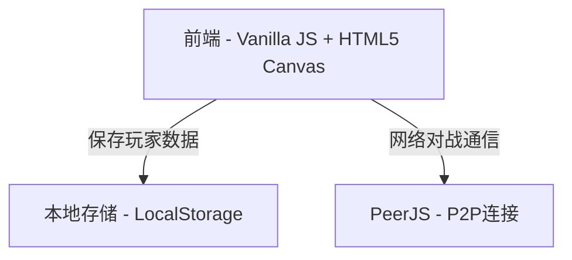
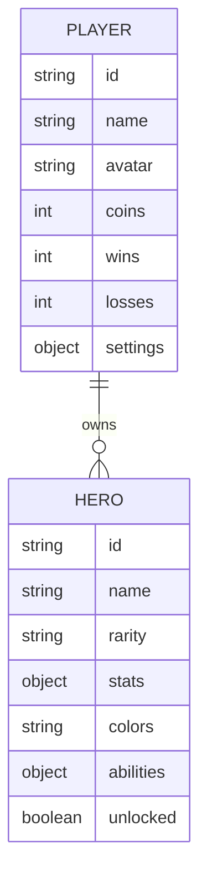

## 1. Architecture Design


## 2. Technology Description
- **前端**: Vanilla JavaScript + HTML5 Canvas + CSS3
- **数据持久化**: LocalStorage
- **网络通信**: PeerJS (WebRTC P2P)
- **构建工具**: 纯前端，无需复杂构建工具，保持单文件可运行特性

## 3. Route Definitions
| 逻辑页面 | 实现方式 | 功能描述 |
|----------|----------|----------|
| 主菜单 | HTML + CSS Overlay | 游戏模式选择、英雄展示、设置入口、抽卡入口 |
| 个性化设置 | HTML + CSS Overlay | 玩家资料、键位设置 |
| 抽卡 | HTML + Canvas Overlay | 抽卡动画、英雄获取 |
| BAN/PICK | HTML + Canvas Overlay | 英雄禁用、选择 |
| 对战 | Canvas 主渲染 | 游戏对战画面 |

## 4. Data Model
### 4.1 Data Model Definition


### 4.2 数据结构定义
```javascript
// 英雄数据结构
const HEROES = {
  blueKnight: {
    id: 'blueKnight',
    name: '蓝骑士',
    rarity: 'common',
    stats: { hp: 100, attack: 15, speed: 5 },
    colors: { primary: '#1a4f8a', secondary: '#5c7c99', highlight: '#f5d742', armor: '#2d6bb3' },
    abilities: ['普通攻击', '护盾防御']
  },
  redWarrior: {
    id: 'redWarrior',
    name: '红战士',
    rarity: 'common',
    stats: { hp: 100, attack: 15, speed: 5 },
    colors: { primary: '#8a2d2d', secondary: '#4a4a4a', highlight: '#4fc3f7', armor: '#c94444' },
    abilities: ['普通攻击', '护盾防御']
  },
  // 更多英雄...
};

// 玩家数据结构
interface PlayerData {
  id: string;
  name: string;
  avatar: string;
  coins: number;
  wins: number;
  losses: number;
  unlockedHeroes: string[];
  settings: {
    keybinds: {
      player1: { jump: string, left: string, right: string, attack: string, defend: string };
      player2: { jump: string, left: string, right: string, attack: string, defend: string };
    };
    colorScheme: string;
  };
}

// BAN/PICK 状态
interface BanPickState {
  phase: 'ban' | 'pick' | 'done';
  currentTurn: 1 | 2;
  bannedHeroes: string[];
  pickedHeroes: { player1: string | null, player2: string | null };
}
```

## 5. 核心功能实现计划
### 5.1 文件结构
保持单 HTML 结构，但内部逻辑模块化：
- `index.html` - 完整的单文件应用

### 5.2 实现步骤
1. **重构游戏循环和状态管理**
   - 添加状态机管理不同页面
   - 完善 localStorage 数据持久化

2. **实现英雄系统**
   - 定义多个英雄数据
   - 扩展 Mech 类支持英雄定制
   - 添加英雄属性和能力差异

3. **实现 BAN/PICK 流程**
   - BAN 阶段界面
   - PICK 阶段界面
   - 网络对战同步

4. **实现抽卡系统**
   - 抽卡概率逻辑
   - 抽卡动画
   - 金币系统

5. **个性化设置**
   - 玩家信息编辑
   - 键位自定义
   - 配色方案选择

6. **界面优化**
   - 统一像素风格
   - 添加动画效果
   - 优化交互反馈
