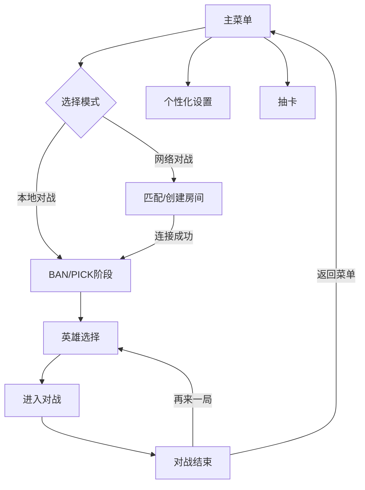

## 1. Product Overview
像素风机甲对战游戏，支持本地和网络对战，新增英雄选择、BAN/PICK机制、抽卡系统和玩家个性化定制功能。解决了当前游戏英雄单一、缺少收集乐趣和玩家定制空间的问题。

## 2. Core Features

### 2.1 User Roles
| Role | Registration Method | Core Permissions |
|------|---------------------|------------------|
| Guest Player | Local storage | Play local games, test heroes |
| Registered Player | Local profile | All features, save progress, customize profile |

### 2.2 Feature Module
1. **主菜单页面**: 英雄展示、玩家信息、游戏模式选择
2. **英雄选择/BAN/PICK页面**: 英雄BAN选、英雄展示、确认选择
3. **抽卡页面**: 抽卡动画、英雄获取、卡包系统
4. **个性化设置页面**: 玩家头像、ID、配色、控制键位
5. **对战页面**: 已有对战功能，支持新英雄

### 2.3 Page Details
| Page Name | Module Name | Feature description |
|-----------|-------------|---------------------|
| 主菜单 | 英雄展示 | 展示玩家拥有的英雄，解锁状态 |
| 主菜单 | 玩家信息 | 显示玩家ID、头像、统计数据 |
| BAN/PICK页面 | 英雄BAN选 | 双方轮流BAN掉不希望对方使用的英雄 |
| BAN/PICK页面 | 英雄选择 | 展示所有英雄信息，双方轮流选择 |
| 抽卡页面 | 卡包系统 | 普通卡包、高级卡包，不同概率获取英雄 |
| 抽卡页面 | 抽卡动画 | 像素风格的抽卡动画，提升抽卡体验 |
| 个性化设置 | 玩家资料 | 修改ID、头像、配色方案 |
| 个性化设置 | 键位设置 | 自定义控制键位 |

## 3. Core Process
玩家从主菜单选择游戏模式 → 本地对战直接进入BAN/PICK → 网络对战先匹配连接 → 双方BAN选英雄 → 选择出战英雄 → 进入对战 → 对战结束展示结果 → 返回菜单或重开。

## 4. User Interface Design
### 4.1 Design Style
- **主色调**: 深蓝 (#1a4f8a) 和深红 (#8a2d2d)，搭配霓虹高亮色 (#4fc3f7, #ff8a80)
- **辅助色**: 灰色 (#4a4a6a)，黄色高亮 (#f5d742)
- **按钮风格**: 像素风边框、渐变填充、悬停发光效果
- **字体**: Pixel 风格字体 + Courier New 等宽字体
- **布局**: 像素化网格布局，霓虹边框装饰
- **图标**: 8-bit 像素图标，复古游戏风格

### 4.2 Page Design Overview
| Page Name | Module Name | UI Elements |
|-----------|-------------|-------------|
| 主菜单 | 整体布局 | 像素背景，霓虹边框，动画标题 |
| BAN/PICK | 英雄面板 | 网格展示，选中效果，BAN掉的英雄灰化 |
| 抽卡 | 抽卡界面 | 闪烁灯光，卡包开合动画，金色/银色边框稀有度标识 |
| 个性化设置 | 设置面板 | 选项卡布局，颜色选择器，键位设置框 |

### 4.3 Responsiveness
- 主要支持桌面端全屏和窗口模式
- 800x600 基础画布，自适应不同屏幕比例
- 触摸设备优化按键布局（可选扩展）

### 4.4 3D Scene Guidance
- 本项目暂不使用3D场景，保持像素风2D渲染风格
